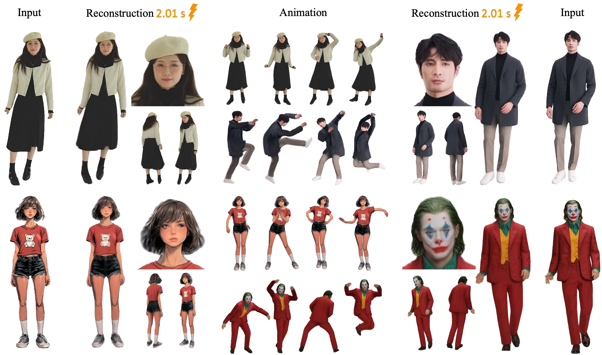
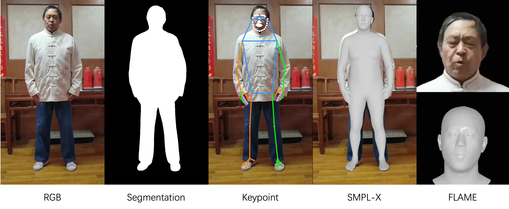

# LHM_Track: Build Your [LHM](https://github.com/aigc3d/LHM) Training Dataset

#####  <p align="center"> [Lingteng Qiu<sup>*</sup>](https://lingtengqiu.github.io/), [Xiaodong Gu<sup>*</sup>](https://scholar.google.com.hk/citations?user=aJPO514AAAAJ&hl=zh-CN&oi=ao), [Peihao Li<sup>*</sup>](https://liphao99.github.io/), [Qi Zuo<sup>*</sup>](https://scholar.google.com/citations?user=UDnHe2IAAAAJ&hl=zh-CN), [Weichao Shen](https://scholar.google.com/citations?user=7gTmYHkAAAAJ&hl=zh-CN), [Junfei Zhang](https://scholar.google.com/citations?user=oJjasIEAAAAJ&hl=en), [Kejie Qiu](https://sites.google.com/site/kejieqiujack/home), [Weihao Yuan](https://weihao-yuan.com/)<br> [Guanying Chen<sup>+</sup>](https://guanyingc.github.io/), [Zilong Dong<sup>+</sup>](https://baike.baidu.com/item/%E8%91%A3%E5%AD%90%E9%BE%99/62931048), [Liefeng Bo](https://scholar.google.com/citations?user=FJwtMf0AAAAJ&hl=zh-CN)</p>
#####  <p align="center"> Tongyi Lab, Alibaba Group</p>

[](https://github.com/aigc3d/LHM)
[](https://aigc3d.github.io/projects/LHM/)
[](https://arxiv.org/pdf/2503.10625)
[](https://huggingface.co/spaces/DyrusQZ/LHM)
[](https://modelscope.cn/studios/Damo_XR_Lab/Motionshop2) 
[](https://creativecommons.org/licenses/by-nc-sa/4.0/legalcode.txt)


<p align="center">
  
</p>

## Description
LHM_Track is a video processing pipeline for building LHM training dataset. It generates multiple labels from human centric video, such as segmentation, 2D keypoints, SMPL-X parameters and FLAME parameters.

<p align="center">
  
</p>


If you find our work useful for you, please ⭐ star [LHM](https://github.com/aigc3d/LHM) and [LHM_Track](https://github.com/aigc3d/LHM_Track) repositories to help us reach more people.

## 📢 Latest Updates
[April 8, 2025] Release the pipeline for building LHM training dataset.


## 🚀 Getting Started


### Environment Setup
Clone the repository.
```bash
git clone https://github.com/aigc3d/LHM_Track.git
cd LHM_Track
```

The environment is not same as the [LHM](https://github.com/aigc3d/LHM) repo. Please create a new conda environment or python venv.
```bash 
# create new environment
conda create -n lhm_track python=3.10
conda activate lhm_track
# or
# python -m venv lhm_track
# source lhm_track/bin/activate

# cuda 12.1
sh ./install_cu121.sh

# cuda 11.8
sh ./install_cu118.sh
```
The installation has been tested with python3.10, CUDA 12.1 or CUDA 11.8.


### Download Prior Model Weights 
Download basic model weights. If you've downloaded them in LHM repo, you can copy/link the `pretrained_models` folder into this repo.
```bash
# Download prior model weights
wget https://virutalbuy-public.oss-cn-hangzhou.aliyuncs.com/share/aigc3d/data/LHM/LHM_prior_model.tar 
tar -xvf LHM_prior_model.tar 
```

Download extra model weights.
```bash
# Download extra model weights
wget https://virutalbuy-public.oss-cn-hangzhou.aliyuncs.com/share/aigc3d/data/LHM/LHM_track_model.tar 
tar -xvf LHM_track_model.tar 
```


### 🏃 Inference Pipeline
```bash
python track_video.py --video_path ${VIDEO_PATH} --output_path ${OUTPUT_PATH}
```


## Citation 
```
@inproceedings{qiu2025LHM,
  title={LHM: Large Animatable Human Reconstruction Model from a Single Image in Seconds},
  author={Lingteng Qiu and Xiaodong Gu and Peihao Li  and Qi Zuo
     and Weichao Shen and Junfei Zhang and Kejie Qiu and Weihao Yuan
     and Guanying Chen and Zilong Dong and Liefeng Bo 
    },
  booktitle={arXiv preprint arXiv:2503.10625},
  year={2025}
}
```

## Acknowledgement
This work is built on many amazing research works and open-source projects:
- [BiRefNet](https://github.com/ZhengPeng7/BiRefNet)
- [GAGAvatar_track](https://github.com/xg-chu/GAGAvatar_track/)
- [multi-hmr](https://github.com/naver/multi-hmr)
- [sapiens](https://github.com/facebookresearch/sapiens)
- [WHAM](https://github.com/yohanshin/WHAM)

Thanks for their excellent works and great contribution to 3D generation and 3D digital human area.
